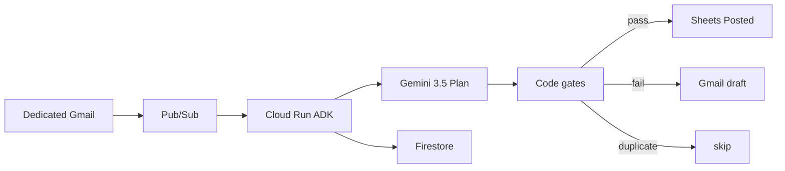

# Olympus VAT Agent

Event-driven Taskmaster agent for the [All Things Agentic Hackathon](https://allthingsagentichackathon.devpost.com/). Repo: [Olympusxvn/olympus-document-agent](https://github.com/Olympusxvn/olympus-document-agent). A dedicated Gmail inbox receives Vietnamese VAT invoices; **Gemini 3.5** proposes a structured Plan; a **harness** validates math and schema in code, then appends **Google Sheets** or creates a **Gmail draft**. The workflow does not start from chat.

**Track:** The Taskmaster  
**Core rule:** the model reasons; the machine executes. See [docs/HARNESS.md](docs/HARNESS.md) and [docs/adr/0001-model-reasons-machine-executes.md](docs/adr/0001-model-reasons-machine-executes.md).

**Judges:** clone, install, and run tests with [docs/JUDGES.md](docs/JUDGES.md). You do not need our Gmail inbox or a GCP project for unit tests.

## Eligibility stack

| Requirement | This project |
|-------------|--------------|
| Gemini 3.5 or newer | Gemini 3.5 Flash via Vertex AI (ADC on Cloud Run) |
| Google agent framework | Google ADK (Python) |
| GCP infrastructure | Cloud Run + Pub/Sub + Firestore |

Not used: Gemini 1.5, model-owned Function Calling to Workspace APIs, FastAPI as a substitute for ADK.

## What it does

1. `users.watch` on a dedicated inbox publishes to Pub/Sub (Cloud Scheduler poll is the fallback).
2. Cloud Run (ADK) loads the message and attachment.
3. Gemini 3.5 returns a Plan (fields + confidence) with **no write tools**.
4. Code gates: required schema, `subtotal + vat == total` (±1 VND), confidence threshold, idempotency (`message-id` and seller MST + invoice number).
5. Pass → one Sheets row (`posted`). Fail / low-confidence → Gmail **draft** to the operator (`needs_review`). Duplicate → `skipped_duplicate`. The agent **never sends** mail.

Domain language: [CONTEXT.md](CONTEXT.md). Architecture: [docs/ARCHITECTURE.md](docs/ARCHITECTURE.md). Demo film: [docs/DEMO.md](docs/DEMO.md).

## Architecture



Gemini only fills JSON. The harness in `harness/` is the only Sheets/Gmail writer. ADK `tools=[]`.

## Status

**Phase 3 (ledger + drafts) is in the repo.** Set `SHEETS_SPREADSHEET_ID` on Cloud Run and share that spreadsheet with the runtime service account. Then a valid invoice email appends a `Posted` row; a wrong total creates a Gmail draft and does not append.

## For judges (clone → install → test)

Full steps: **[docs/JUDGES.md](docs/JUDGES.md)**.

```bash
git clone https://github.com/Olympusxvn/olympus-document-agent.git
cd olympus-document-agent
python -m venv .venv
source .venv/bin/activate          # Windows Git Bash; PowerShell: .\.venv\Scripts\Activate.ps1
python -m pip install -r requirements.txt
python -m pytest tests -q
```

Expected: all tests pass. No Google Cloud credentials required. Harness tests use fakes — they prove pass writes a ledger row, math-fail drafts and does not write, duplicate skips both.

Optional hosted check:

```bash
curl https://olympus-document-agent-78140974757.asia-southeast1.run.app/health
```

Expected: `"phase": 3`. `"sheets_configured": true` only after `SHEETS_SPREADSHEET_ID` is set on Cloud Run.

## Spin-up (Cloud Run)

GitHub → Cloud Run is the deploy path. Gmail, Vertex, and Sheets use **Application Default Credentials** on the Cloud Run runtime service account. Do **not** set `GMAIL_CLIENT_ID`, `GMAIL_CLIENT_SECRET`, or `GMAIL_REFRESH_TOKEN`.

Cloud Run **Variables & Secrets**:

- `GOOGLE_CLOUD_PROJECT` = `olympus-vat-agent`
- `GOOGLE_CLOUD_LOCATION` = `global` (Vertex Gemini)
- `GOOGLE_GENAI_USE_VERTEXAI` = `TRUE`
- `GEMINI_MODEL` = `gemini-3.5-flash` (optional)
- `GMAIL_ADDRESS` = mailbox to watch (Workspace user if domain-wide delegation)
- `GMAIL_OPERATOR` = draft recipient (defaults to `GMAIL_ADDRESS`)
- `GMAIL_PUBSUB_TOPIC` = `projects/olympus-vat-agent/topics/gmail-vat`
- `INGEST_TOKEN` = shared secret for `/internal/*`
- `SHEETS_SPREADSHEET_ID` = demo spreadsheet id (required for `posted`)
- `SHEETS_POSTED_TAB` = `Posted`
- `HARNESS_CONFIDENCE_THRESHOLD` = `0.75` (optional)
- `HARNESS_MATH_TOLERANCE_VND` = `1` (optional)

Share the spreadsheet with the Cloud Run runtime service account (Editor). First row of tab `Posted` should be headers: `posted_at, message_id, invoice_number, seller_mst, invoice_date, subtotal, vat_amount, total, confidence`.

The runtime SA needs Gmail (read + compose/drafts), Sheets, and **Vertex AI User**.

Ingest (asia-southeast1): `https://olympus-document-agent-78140974757.asia-southeast1.run.app/`

- `GET /health` → `{"status":"ok","phase":3,...}`
- `GET /runs` → recent Firestore runs
- Pub/Sub push: `POST /pubsub`

Daily: `POST /internal/watch-renew` with header `X-Ingest-Token` (watch expires in ~7 days). Fallback: Scheduler `POST /internal/poll`.

Local tests: `python -m pytest tests -q`.

## Out of scope for v1

Business cards, Google Contacts, sending email, ERP connectors, chat-as-trigger, manual invoice upload.

## License

TBD by the contest submission.
