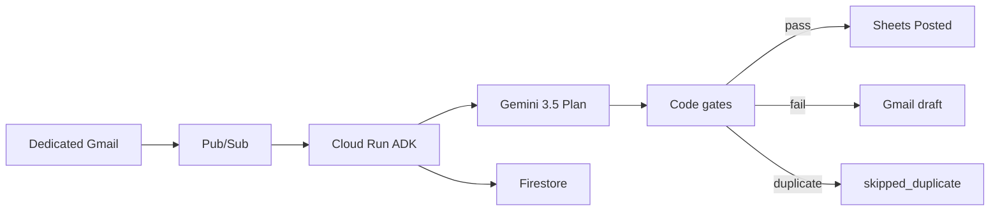

<div align="center">

# 🧾 Olympus VAT Agent

### *The model reasons. The machine executes.*

**All Things Agentic · The Taskmaster · Vietnamese VAT invoices**

<br />

[](https://allthingsagentichackathon.devpost.com/)
[](https://allthingsagentichackathon.devpost.com/)
[](docs/HARNESS.md)

<br />

[](https://olympus-document-agent-78140974757.asia-southeast1.run.app/health)
[](docs/JUDGES.md)
[](docs/HARNESS.md)
[](https://github.com/Olympusxvn/olympus-document-agent)

<br />

[](https://www.python.org/)
[](https://ai.google.dev/)
[](https://google.github.io/adk-docs/)
[](https://olympus-document-agent-78140974757.asia-southeast1.run.app/health)
[](https://docs.pydantic.dev/)
[](#-license)

<br />

> **New here?** Clone, `pytest`, done — no Gmail inbox and no GCP project required.

<br />

```
Gmail (dedicated) → Pub/Sub → Cloud Run (ADK)
                                  ├─ Gemini 3.5: Plan JSON + confidence
                                  └─ Harness: gates → Sheets Posted | Gmail draft
                         Firestore = Run source of truth
```

</div>

---

## 📑 Contents

| | |
|:---|:---|
| ⚖️ | [For judges](#-for-judges--5-min-verify) |
| 🏗️ | [Overview](#️-overview) |
| ⚡ | [Quick start](#-quick-start) |
| ☁️ | [Cloud Run](#️-cloud-run) |
| 📚 | [Documentation](#-documentation) |
| ✅ | [Checklist](#-checklist) |
| 🔒 | [Security](#-security) |

---

<div align="center">

## ⚖️ For judges — 5 min verify

**No API keys. No OAuth client secrets. No dedicated inbox.**

Unit tests prove: pass writes a ledger row · math-fail drafts and does **not** write · duplicate skips both · ADK `tools=[]`.

</div>

```bash
git clone https://github.com/Olympusxvn/olympus-document-agent.git
cd olympus-document-agent
python -m venv .venv
source .venv/bin/activate          # Windows PowerShell: .\.venv\Scripts\Activate.ps1
python -m pip install -r requirements.txt
python -m pytest tests -q
```

Expected: all tests in `tests/` pass. If `google-adk` did not install, `test_agent_stub.py` skips; the rest still pass.

```bash
curl https://olympus-document-agent-78140974757.asia-southeast1.run.app/health
```

Expected: `"phase": 3`. `"sheets_configured": true` only after `SHEETS_SPREADSHEET_ID` is set on Cloud Run.

| 🔗 Resource | 📍 Link |
|:------------|:--------|
| **⚖️ Judge runbook** | [docs/JUDGES.md](docs/JUDGES.md) |
| **📜 Harness contract** | [docs/HARNESS.md](docs/HARNESS.md) |
| **🎬 Demo script** | [docs/DEMO.md](docs/DEMO.md) |
| **🏗️ Architecture** | [docs/ARCHITECTURE.md](docs/ARCHITECTURE.md) |
| **🌐 Live `/health`** | [Cloud Run](https://olympus-document-agent-78140974757.asia-southeast1.run.app/health) |

<details>
<summary><strong>🪟 Activate venv on Windows</strong></summary>

| Shell | Command |
|:------|:--------|
| **PowerShell** | `.\.venv\Scripts\Activate.ps1` |
| **Git Bash** | `source .venv/Scripts/activate` |
| **cmd** | `.venv\Scripts\activate.bat` |

</details>

---

## 🏗️ Overview

A dedicated Gmail inbox receives Vietnamese VAT invoices (photo or PDF). **Gemini 3.5** proposes a Plan. A **Python harness** checks math and schema, then appends **Google Sheets** or creates a **Gmail draft**. Chat is not the trigger.

| Layer | Responsibility |
|:------|:---------------|
| **📬 Ingest** | `users.watch` → Pub/Sub → Cloud Run; Firestore Run `received` |
| **🤖 Model** | Gemini 3.5 Flash: Plan JSON + confidence. ADK `tools=[]` |
| **🧮 Gates** | Schema, `subtotal + VAT == total` (±1 VND), confidence ≥ 0.75, duplicate identity |
| **✍️ Harness** | Pass → Sheets `Posted`. Fail → Gmail draft. Never `messages.send` |



| Eligibility | This project |
|:------------|:-------------|
| Gemini 3.5 or newer | Gemini 3.5 Flash via Vertex AI (ADC) |
| Google agent framework | Google ADK (Python) on Cloud Run |
| GCP infrastructure | Cloud Run + Pub/Sub + Firestore |

Not used: Gemini 1.5, model-owned Function Calling to Workspace APIs, FastAPI as a substitute for ADK.

**Statuses:** `received` → `extracting` → `validating` → `posted` \| `needs_review` \| `skipped_duplicate`. `validated` means gates passed but `SHEETS_SPREADSHEET_ID` is unset.

---

## ⚡ Quick start

Same as the judge path. Full notes: [docs/JUDGES.md](docs/JUDGES.md).

```bash
python -m pip install -r requirements.txt
python -m pytest tests -q
```

Optional local health (no GCP). `GET /runs` needs Firestore and will fail on a laptop.

```bash
python -m uvicorn main:app --host 127.0.0.1 --port 8080
curl http://127.0.0.1:8080/health
```

---

## ☁️ Cloud Run

GitHub → Cloud Build → Cloud Run (`asia-southeast1`). Gmail, Vertex, and Sheets use **Application Default Credentials** on the runtime service account.

Do **not** set `GMAIL_CLIENT_ID`, `GMAIL_CLIENT_SECRET`, or `GMAIL_REFRESH_TOKEN`.

| 🔗 Endpoint | 📍 Role |
|:------------|:--------|
| `GET /health` | `{"status":"ok","phase":3,"sheets_configured":...}` |
| `GET /runs` | Recent Firestore Runs |
| `POST /pubsub` | Gmail Pub/Sub push |
| `POST /internal/watch-renew` | Renew `users.watch` (~7 day expiry) |
| `POST /internal/poll` | Scheduler fallback |

Share the demo spreadsheet with the runtime SA (Editor). Tab `Posted` header row:

`posted_at, message_id, invoice_number, seller_mst, invoice_date, subtotal, vat_amount, total, confidence`

<details>
<summary><strong>🔐 Cloud Run environment</strong></summary>

| Variable | Value / notes |
|:---------|:--------------|
| `GOOGLE_CLOUD_PROJECT` | `olympus-vat-agent` |
| `GOOGLE_CLOUD_LOCATION` | `global` (Vertex Gemini) |
| `GOOGLE_GENAI_USE_VERTEXAI` | `TRUE` |
| `GEMINI_MODEL` | `gemini-3.5-flash` (optional) |
| `GMAIL_ADDRESS` | Mailbox to watch (Workspace DWD if a user mailbox) |
| `GMAIL_OPERATOR` | Draft recipient (defaults to `GMAIL_ADDRESS`) |
| `GMAIL_PUBSUB_TOPIC` | `projects/olympus-vat-agent/topics/gmail-vat` |
| `INGEST_TOKEN` | Secret for `/internal/*` |
| `SHEETS_SPREADSHEET_ID` | Required for `posted` |
| `SHEETS_POSTED_TAB` | `Posted` |
| `HARNESS_CONFIDENCE_THRESHOLD` | `0.75` |
| `HARNESS_MATH_TOLERANCE_VND` | `1` |

Runtime SA needs Gmail (read + compose/drafts), Sheets, and **Vertex AI User**. Daily: `POST /internal/watch-renew` with `X-Ingest-Token`.

</details>

---

## 📚 Documentation

| 📄 Document | 🎯 Purpose |
|:------------|:-----------|
| [docs/JUDGES.md](docs/JUDGES.md) | Clone · install · pytest |
| [docs/HARNESS.md](docs/HARNESS.md) | Plan schema, gates, write policy |
| [docs/ARCHITECTURE.md](docs/ARCHITECTURE.md) | Split of responsibility |
| [docs/DEMO.md](docs/DEMO.md) | 4-minute pass / fail / duplicate film |
| [docs/OPERATOR_PROMPT.md](docs/OPERATOR_PROMPT.md) | English Operator UI rewrite prompt |
| [CONTEXT.md](CONTEXT.md) | Domain terms (Plan, Harness, Posted) |
| [docs/adr/0001-model-reasons-machine-executes.md](docs/adr/0001-model-reasons-machine-executes.md) | Why the model cannot write |

<details>
<summary><strong>🔗 References</strong></summary>

| Resource | URL |
|:---------|:----|
| Hackathon | https://allthingsagentichackathon.devpost.com/ |
| Public repo | https://github.com/Olympusxvn/olympus-document-agent |
| Live ingest | https://olympus-document-agent-78140974757.asia-southeast1.run.app/ |
| Google ADK | https://google.github.io/adk-docs/ |

</details>

---

## ✅ Checklist

- [x] Gmail event starts the run (not chat, not upload)
- [x] Gemini 3.5 Plan JSON only — ADK `tools=[]`
- [x] Code gates: schema, math, confidence, duplicate
- [x] Pass → Sheets `posted` (when spreadsheet id is set)
- [x] Fail → Gmail draft, never send
- [ ] Film [docs/DEMO.md](docs/DEMO.md) with Cloud Console proof

**Out of scope for v1:** business cards, Google Contacts, sending email, ERP connectors, chat-as-trigger, manual invoice upload.

---

## 🔒 Security

- ADC on Cloud Run only. No API keys, no OAuth client JSON in env.
- Harness is the only Sheets / Gmail writer. Forbidden: `messages.send`.
- `/internal/*` requires `INGEST_TOKEN` when that env is set.
- Never commit `.env`, `credentials.json`, or refresh tokens.

---

## 📄 License

TBD by the contest submission.

---

<div align="center">

**Olympus VAT Agent**

*If the totals do not add up, we refuse to write the ledger.*

[](https://github.com/Olympusxvn/olympus-document-agent/stargazers)

</div>
