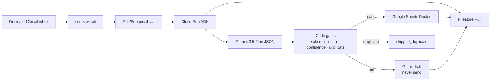

# Architecture

Taskmaster path: a Gmail event starts the run. Gemini only proposes a Plan. The harness is the only writer.

## Split of responsibility

| Component | May do | Must not do |
|-----------|--------|-------------|
| Gemini 3.5 (ADK `tools=[]`) | Return Plan JSON + confidence | Call Sheets or Gmail APIs |
| Harness (`harness/sheets.py`, `harness/drafts.py`) | `spreadsheets.values.append`, `drafts.create` | `messages.send`, skip gates |
| Ingest | Pub/Sub decode, Gmail fetch, `received` | Write the ledger |

## Status machine

`received` → `extracting` → `validating` → `posted` | `needs_review` | `skipped_duplicate`

`validated` is used only when `SHEETS_SPREADSHEET_ID` is unset (no ledger configured).

## Auth

Cloud Run runtime service account via Application Default Credentials. No OAuth client secrets. Share the demo Sheet with that service account (and the impersonated Workspace user if domain-wide delegation is on).
